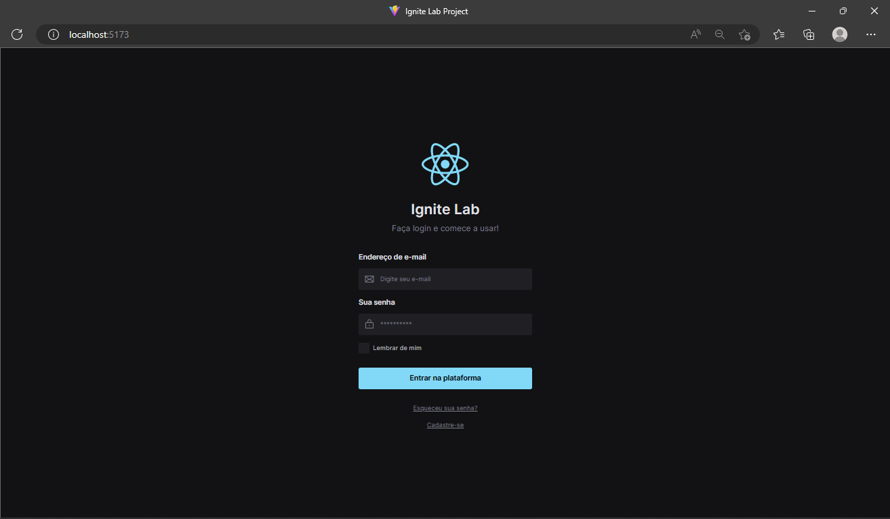

Link Projeto Figma: 

https://www.figma.com/file/v1hBXOGt6wG57rkAv0eYp8/Ignitelab?node-id=1%3A9&t=Fk45HCv7b6QKF7HL-0

# Para rodar o projeto
No terminal, para rodar o servidor execute:

### `cd Aplication`
### `npm install`
### `npm run dev`

## Para visualizar storybook components e docs da aplicação execute em outro terminal:

### `cd react-design-system`
### `npm run storybook`

obs: 
Para "corrigir" um possivel erro de incompatibilidade execute:  
export NODE_OPTIONS=--openssl-legacy-provider

## Layout web

# Tecnologias utilizadas
- TypeScript
- ReactJS
- Vite
- Tailwind
- storybook

# Dependencias de desenvolvimento utilizadas

- Postcss e Autoprefixer
- phosphor react
- radix UI
- clsx
- React checkbox

# Autor

Lucas Soares 

https://www.linkedin.com/in/lucas-soares-4a6257224/

